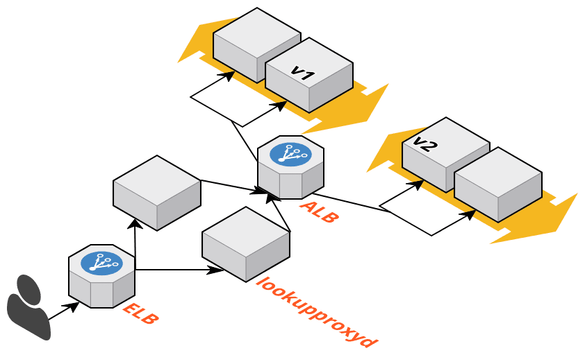

This HTTP proxy is meant to inspect an incoming request, load properties from a Redis database, then
pass the request back to a downstream server.

## Motivation

Say you have `CustomerA`, `CustomerB`, `CustomerC` (and D, E ...). All customers are running a certain version of your software. For
example, `CustomerA` and `CustomerB` are using `v1.0` and `CustomerC` is using `v2.0`.

When a request comes in, you need to know which backend app server to pass it to. This proxy is meant to be used in
conjunction with a node balancing server like Amazon's ALB that can balance requests to app servers in a cluster.



(The front ELB in this example is just for HA on lookupproxyd servers.)

Using this proxy you can re-write the host, path or port of the request so enable intelligent routing to your
backend cluster.

```
in -> foo.example.com:80 -> lookupproxyd -> foo.example.com:{ -> ALB -> v1 cluster
```

## Example Usage

```
# First install the tool
go get github.com/chroder/lookupproxyd

# Then run it
lookupproxyd \
    --redis-host localhost:32774 \
    --target-host localhost:4242 \
    --send-keys "account_id,db_name,app_version" \
    --rewrite-host "{{.Lookup.app_version}}.{{.Request.Host}}"
[lookupproxyd] Starting...
[lookupproxyd] Listening on 	:8100
[lookupproxyd] Proxying to  	localhost:4242 (http)
[lookupproxyd] Redis host   	localhost:32774
[lookupproxyd] Host pattern  	{{.Lookup.app_version}}.{{.Request.Host}}
```

## CLI Options

You can see this by execiting `lookupproxyd help`.

```
NAME:
   lookupproxyd - Listens for HTTP requests performs a lookup in a Redis database, modifies Host and adds an X-header with optional values, then forwards it to a backend.

USAGE:
   lookupproxyd [global options] command [command options] [arguments...]

VERSION:
   0.0.0

COMMANDS:
     help, h  Shows a list of commands or help for one command

GLOBAL OPTIONS:
   --listen value, -i value         The address to listen on. E.g. :8100 or 1.2.3.4:8100 for a particular interface (default: ":8100")
   --redis-host value, -r value     The Redis host. E.g. 1.2.3.4:6379
   --redis-auth value, -a value     If the Redis server requires auth
   --target-host value, -t value    The target host to forward to. E.g. 1.2.3.4:80. This is a template can variables can be used. E.g. 1.2.3.4:{{.Lookup.XXX}}. Note: Not a URL; don't enter protocol.
   --target-scheme value, -m value  The target scheme to use (http or https). (default: "http")
   --log-level value, -l value      Specify: debug, info, warning, error, fatal, panic (default: "warning")
   --rewrite-host value, -w value   Specify a template to rewrite the Host as. The provided host will be in {{.Request.Host}} and data from the lookup in {{.Lookup.XXX}}. If you do not specify a value, no host rewrite will happen.
   --rewrite-path value, -p value   Specify a template to rewrite the Path as. The provided path will be in {{.Request.URL.Path}} and data from the lookup in {{.Lookup.XXX}}. If you do not specify a value, no path rewrite will happen.
   --send-keys value, -s value      Specify a list of keys to send in the X-header (JSON encoded). If none provided, or the keys don't exist in the lookup, no X-header will be sent.
   --send-header value, -x value    Specify the name of the X-header to send values in. (default: "X-Lookup")
   --trust-upstream, -u             Set this to trust the upstream host (trusts X-Forwarded headers and passes them on). (default: false)
   --help, -h                       show help (default: false)
   --version, -v                    print the version (default: false)
```
